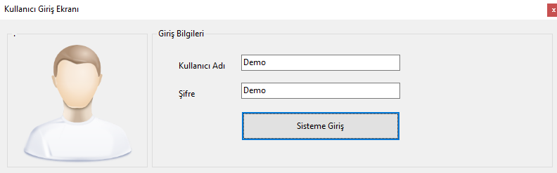
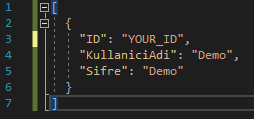
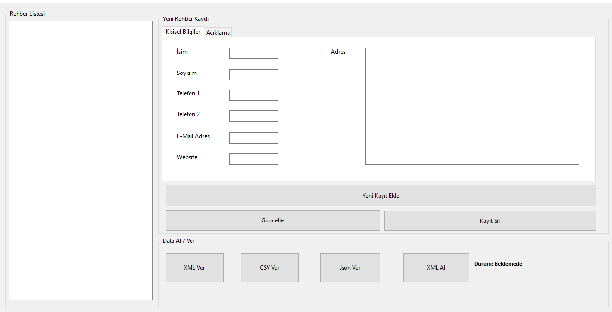

<div align="center">
  
</div>

##  C# Mobile Contact Application

We will create a simple mobile contact by performing json links using C# Windows Form. In addition to Adding, Deleting and Updating Contacts in our directory, we will also download the directory in different formats.

When we run the application for the first time, a login form will appear.



When the application is entered, a json error appears. To solve this; '[' at the beginning of the line and ']' at the end of the line.



By running the application again, the system is logged in and, the phone book form appears.



In the DatabaseLogicLayer.cs file, the relevant places can be corrected and saved to the desired locations.

```C#
private void VeriTabaniKontrol()
{
    bool KlasorKontrol = Directory.Exists(@"c:\TelefonRehberiDB\"); // Check if the folder exists
    if(!KlasorKontrol) // If the created folder does not exist
    {
        Directory.CreateDirectory(@"c:\TelefonRehberiDB\"); // Folder created.

        // If there is no file and user related to the program, a new file and
        // User assignment is done automatically by the program.
        Kullanici Demo = new Kullanici();
        Demo.ID = Guid.NewGuid();
        Demo.KullaniciAdi = "Demo";
        Demo.Sifre = "Demo";

        // Program admin information is translated as json.
        string JsonKullaniciText = Newtonsoft.Json.JsonConvert.SerializeObject(Demo);
        File.WriteAllText(@"c:\TelefonRehberiDB\kullanici.json", JsonKullaniciText);
    }
}
```

##  Contact Information

You can reach out to me using the following contact details:

[](mailto:info@sinanozcelik.com)

[](https://sinanozcelik.com)

I'm always open to development and collaboration. Feel free to reach out to me!